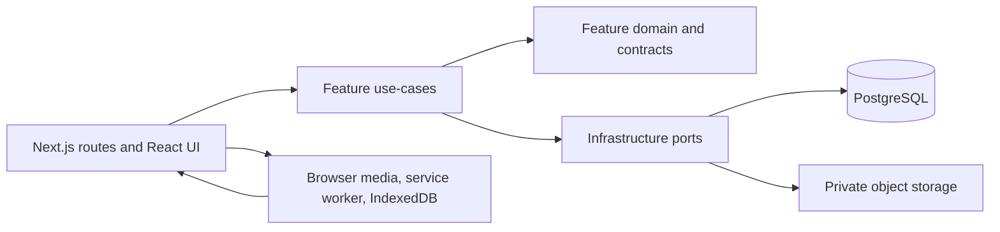
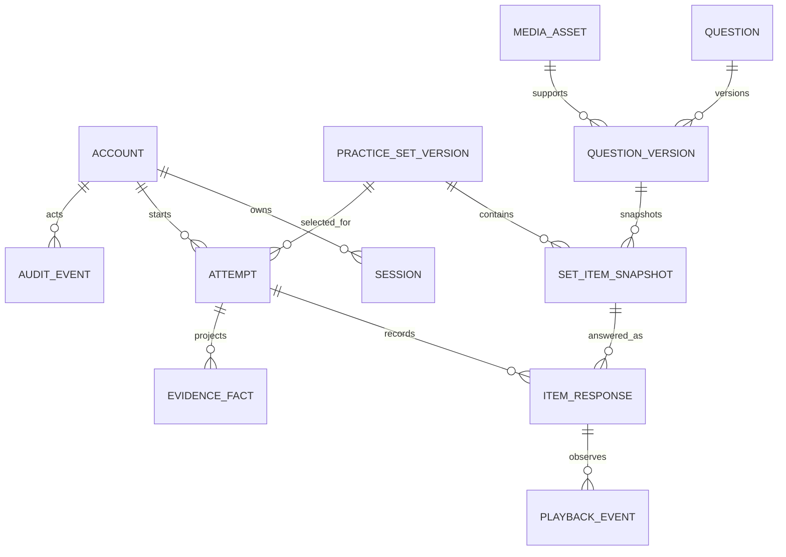
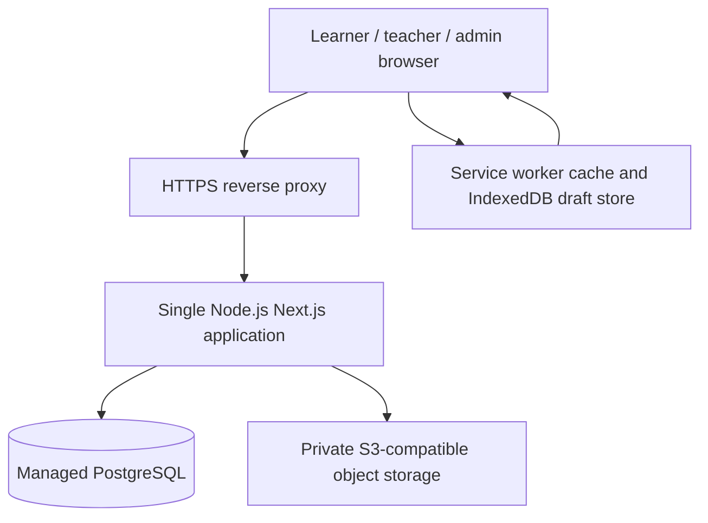

# Architecture Spine - CambridgeYLE P0

> This document owns technical invariants, not product decisions. The PRD Decision Register owns every open gate. Core P0 architecture is implementation-ready; AI draft generation, public curriculum claims and production deployment remain separately gated.

## Design Paradigm

**Modular monolith with ports and adapters.** A single Next.js deployment owns all P0 business capabilities. A feature owns its use-cases and persistence access; its UI routes and API transport call those use-cases. Cross-feature reads use feature query services, not direct table access. External systems are reached through ports owned by `infrastructure`.

The practice domain supports exactly the five P0 engines `picture_true_false`, `picture_yes_no`, `audio_picture_choice`, `audio_note_taking`, and `word_bank_cloze`. It exposes them through learner-selected, published practice-set snapshots and history-based recommendations.



## Invariants & Rules

### AD-1 - Feature ownership and dependency direction

- **Binds:** all P0 capabilities
- **Prevents:** route handlers containing business rules, or features directly importing another feature's repositories and tables
- **Rule:** Organize code under `src/features/<feature>/{domain,application,infrastructure,ui}`. UI and route handlers call application use-cases only. A feature may import `src/shared` contracts and infrastructure ports; cross-feature data is exposed as a typed query/use-case contract owned by the source feature.

### AD-2 - Server-authoritative practice lifecycle

- **Binds:** learner-practice, deterministic-scoring, teacher-evidence, media-and-pwa
- **Prevents:** client-side answer checking, client-calculated results, or results visible before a final submission
- **Rule:** The browser may render questions, preload/play approved media, collect answers/playback events, and persist a recoverable draft. The server validates authorisation and request shape, creates/updates attempts, finalises submission, scores, projects evidence, and releases answer-review data only after `submitted_at` is set.

### AD-3 - Immutable publication and attempt snapshots

- **Binds:** learner-practice, deterministic-scoring, teacher-evidence, content-publication
- **Prevents:** edited or retired questions changing a completed result, answer key, feedback, tags, or media reference
- **Rule:** Publication atomically rejects any non-approved question or media version, then materializes versioned item snapshots with rendered prompt/options, answer policy, feedback, curriculum tags, audience-scoped accessibility metadata, and immutable media object version/content hash. An attempt references exactly one published set version and its item snapshots. Editable question records never supply content or scoring data to an active or completed attempt. Snapshot media objects are write-once and retained while any publication or attempt references them.

### AD-4 - Versioned drafts and atomic, idempotent finalisation

- **Binds:** learner-practice, deterministic-scoring, teacher-evidence
- **Prevents:** duplicate submissions, partial result persistence, evidence that disagrees with item scores, or replayed submit requests changing an attempt
- **Rule:** Every response/playback write requires the authenticated account ID, attempt ID and expected monotonic `revision`, locks the attempt, and requires `status = open`. A stale revision or another tab/device winning the write returns `ATTEMPT_REVISION_CONFLICT`; account or practice-set key mismatch returns `ATTEMPT_SCOPE_MISMATCH`; a different idempotency key after finalisation or any post-submit write returns `ATTEMPT_FINALISED`. None overwrites server state. `startAttempt(setVersionId)` atomically rechecks actor authorisation, published snapshot state, and essential-media authorisation/availability before creating the open attempt; failure creates no usable attempt. `submitAttempt(attemptId, expectedRevision, idempotencyKey)` runs once in a PostgreSQL transaction, reconciles the final client draft against the current revision, locks and closes the write set, validates its published snapshot, persists final responses/events, scores, projects evidence and marks the attempt submitted. A retry with the same key returns the saved result. The server response always returns the authoritative revision/state so the client can reload rather than merge answers silently.

### AD-5 - Deterministic scoring and uncertainty ownership

- **Binds:** deterministic-scoring, teacher-evidence, content-publication
- **Prevents:** an LLM or UI heuristic deciding correctness, silent acceptance of ambiguous short answers, and scoring differences between task engines
- **Rule:** The server scoring module consumes only the snapshot's versioned machine-readable `AnswerPolicy`, including exact Unicode normalisation, case/locale, whitespace/punctuation, number, accepted-answer matching semantics, and shared conformance vectors. It returns only `correct`, `incorrect`, `unanswered`, or `needs_teacher_review`. `effectiveOutcome` equals the automatic outcome unless an immutable teacher resolution exists. Teacher resolution requires the current resolution revision; a concurrent stale mutation returns `TEACHER_RESOLUTION_CONFLICT`. A correction creates a new immutable resolution version rather than overwriting history, then transactionally updates affected item evidence and aggregates from `effectiveOutcome`.

### AD-6 - Authorisation at the application boundary

- **Binds:** account-management, learner-practice, teacher-evidence, content-publication
- **Prevents:** role checks that exist only in navigation/UI, ID-based data exposure, or unapproved centre-wide access to child data
- **Rule:** Every application use-case receives an authenticated actor and authorises both role and resource scope before reading or mutating data. Roles are `learner`, `teacher`, `academic_lead` and `admin`. Learner is limited to own practice choices, attempts and results. Teacher reads published content and detailed evidence for every learner account. `academic_lead` additionally creates, edits, reruns, approves and publishes content, and resolves uncertain outcomes. Admin has all P0 permissions and manages roles. Every staff evidence read and mutation writes an audit event. P0 has no cohort, class or teacher-assignment scope.

### AD-7 - Media security and PWA caching boundary

- **Binds:** media-and-pwa, learner-practice, content-publication
- **Prevents:** public enumeration of learner media, starting incomplete listening tasks, stale answer-bearing data in browser caches, or object storage being treated as a source of truth
- **Rule:** PostgreSQL owns media metadata, approval/version state, and associations; private S3-compatible storage holds binary objects. The server issues short-lived authorised media URLs only for a published snapshot. Before an attempt starts, the client verifies all essential snapshot assets are available and the start transaction revalidates them. Every cache/IndexedDB key is namespaced by authenticated account ID plus attempt and set-version IDs; account switch, sign-out or deactivation purges only the previous account's authorised assets and drafts before rendering the next account. A key/account mismatch is rejected, never adopted. Teacher/admin accessibility metadata is role-scoped; publication rejects learner-facing text/transcripts that reveal an answer. P0 has no alternate accessible task variant: when essential media cannot be used, the media-dependent set remains unavailable. The service worker caches static application-shell assets and authorised set assets only; it must not cache API, HTML/document, result, evidence, answer-review, or signed-URL responses. IndexedDB stores local open-attempt drafts only.

### AD-8 - Account deactivation, audit, and PII minimization

- **Binds:** account-management, supervised-first-practice, teacher-evidence
- **Prevents:** deactivated users retaining a session, accidental irreversible data loss, or audit trails that retain learner answers unnecessarily
- **Rule:** Account deactivation and role mutation are admin-only server transactions. Each locks the active-admin set and returns `LAST_ACTIVE_ADMIN` without mutation or session revocation if it would leave no active admin. Otherwise deactivation sets `deactivated_at`/`deactivated_by`, revokes active sessions, prevents all future authentication/authorisation, and emits an audit event containing actor, action, target opaque ID, and timestamp only. GrapeSeed English retains practice and first-practice records indefinitely after deactivation; P0 does not process deletion requests, purge or delete learner data. An admin handles access/correction requests, but submitted attempts, snapshots, scores, and audit records cannot be changed. Store the minimum account profile necessary for centre operation and do not introduce speaking recordings.

### AD-9 - Schema migrations and typed boundary validation

- **Binds:** all P0 capabilities
- **Prevents:** manual production schema edits, schema/code drift, or trusting browser/admin payloads as valid curriculum/content data
- **Rule:** PostgreSQL changes ship as reviewed, ordered Drizzle migrations and execute before application rollout. All external input is parsed with shared Zod schemas at the route/action boundary; staff-supplied rich text is sanitised before storage/rendering, and media uploads pass allowlisted type, size, content-integrity, and malicious-content safety checks before review. Domain/use-case input types are inferred from or mapped from those validated contracts. Before review/publication, server validation emits publish-blocking results for required tags, allowed vocabulary/grammar, approved names/numbers, task-template sentence/option limits, answer keys/alternatives, required approved media, provenance, sanitisation, and upload-safety findings. An `academic_lead` or admin exception is explicit, justified, and audit logged only where the PRD permits an exception.

### AD-10 - Evidence projection and first-practice scope

- **Binds:** teacher-evidence, supervised-first-practice, deterministic-scoring
- **Prevents:** dashboards with incompatible aggregation dimensions, uncertain outcomes counted as right/wrong, and a P0 first-practice flow beyond published self-directed practice
- **Rule:** Evidence facts derive only from immutable item snapshots and expose learner, paper, part, vocabulary, grammar, spelling, names, numbers, colours, positions, topic, practice set, submitted time, automatic outcome, effective outcome, and effective-resolution version where applicable. Product evidence states are only `secure`, `building`, `needs practice`, and `not assessed yet`. For a paper/part and language target within the fixed previous 30 days, only the latest submitted attempt of each practice set contributes; there is no teacher-selectable time range. Drill-down may show retained matching submissions outside that window without recalculating the state. Fewer than three assessable outcomes is `not assessed yet`, under 60% correct is `needs practice`, 60% to under 80% is `building`, and 80% or more is `secure`; unresolved `needs_teacher_review` is excluded. Resolution corrections append an immutable version and transactionally rebuild current staff projections from its effective outcome, without altering automatic outcomes, learner-visible submitted results, or history. Recommendations rank matching published sets for `needs practice`, then `building`, then other selectable sets, and never remove learner choice. P0 first practice is admin-supervised use of published self-directed practice; no separate diagnostic template, public acquisition, or self-registration flow is introduced.

### AD-11 - Content provenance is publish-blocking

- **Binds:** content-publication, media-and-pwa, learner-practice
- **Prevents:** publishing source material with unknown rights, unpublished AI output, or later losing the evidence needed to audit an approved snapshot
- **Rule:** Every question version and every referenced image, audio, script, and learner feedback record has immutable provenance metadata: `origin` (`original`, `licensed`, or `generated`), creator/source reference, rights or license reference where applicable, and generation metadata where applicable. Publication rejects incomplete provenance and snapshots this metadata with the published set. AI-originated records remain drafts until an `academic_lead` or admin approves them. Staff-supplied content retains sanitisation and upload-safety outcomes with its review record.

### AD-12 - Separate content state machines and grandfathering

- **Binds:** content-publication, learner-practice, media-and-pwa
- **Prevents:** one asset state implicitly publishing another, rejection destroying review history, source revision mutating a publication, or retirement breaking an active attempt
- **Rule:** Question versions, media versions and practice-set versions each enforce their own `draft -> in_review -> approved -> published -> retired` transitions. `in_review -> rejected` records actor/reason/time and creates a new editable draft version; revision never mutates a published version. Set publication atomically verifies every referenced question/media version is published and snapshots it. Retirement prevents new publication/selection but grandfathers open/submitted attempts against immutable snapshot/media versions. Two OpenAI-compatible gateways may create drafts only after `GATE-AI-DRAFT-PROVIDER` closes: the text gateway accepts text/image input and returns text, while the image gateway accepts text/image input and returns an image. Each call uses its own server-only API key and sends only curriculum/assessment guidance, content metadata, academic-lead/admin prompts, permitted content-reference images and the draft under review; it never sends learner identity/account/attempt/response/evidence data. Every AI draft records gateway kind, endpoint identifier, model, input-prompt/reference provenance and output hash; text and image drafts both require `academic_lead`/admin review and manual publication.

### AD-13 - Self-directed selection and recommendation boundary

- **Binds:** learner-practice, teacher-evidence, supervised-first-practice
- **Prevents:** recommendation output becoming mandatory practice, retired content being selected, or recommendation logic exposing another learner's data
- **Rule:** A learner starts an attempt from a selected published set version. The recommendation query reads only that learner's immutable evidence facts and ranks eligible published sets by the evidence-state order in AD-10. It records recommendation version and shown set IDs for audit, does not create an assignment record, and always allows the learner to choose another published set by topic or task type.

## Consistency Conventions

| Concern | Convention |
| --- | --- |
| Naming | TypeScript uses `camelCase`; database uses `snake_case`; feature names use singular kebab-case directories; opaque UUIDv7 IDs are exposed outside the database. |
| Time and state | Persist `timestamptz` in UTC. Lifecycle states are explicit database enums/check constraints, never inferred from nullable fields. |
| API and errors | Route handlers return `{ data }` on success or `{ error: { code, message } }` on expected failure. Use stable machine codes; do not reveal login/account existence details. |
| Mutations | All mutation handlers authenticate, authorise, parse Zod input, invoke one application use-case, and write an audit event when content status, AI-draft request, account, teacher-evidence read, or teacher-review state changes. |
| Transactions | A use-case owns its transaction boundary. Repositories do not start nested transactions. Finalisation, publication, account deactivation, and teacher review are transactional. |
| Logs and audit | Structured application logs use request ID, actor opaque ID, feature/action, outcome, and error code. Never log passwords, session IDs, learner responses, answer keys, signed URLs, or raw audio. |
| Configuration | Environment variables are parsed at startup. `AI_TEXT_GATEWAY_BASE_URL`, `AI_TEXT_GATEWAY_MODEL` and `AI_TEXT_GATEWAY_API_KEY` configure the OpenAI-compatible text gateway; `AI_IMAGE_GATEWAY_BASE_URL`, `AI_IMAGE_GATEWAY_MODEL` and `AI_IMAGE_GATEWAY_API_KEY` configure the OpenAI-compatible image gateway. All are server-only; browser-visible configuration is limited to non-secret public values. |

## Stack

| Name | Version |
| --- | --- |
| Node.js LTS | 24.19.0 |
| TypeScript | 5.9.3 |
| Next.js App Router | 16.3.1 |
| React and React DOM | 19.2.8 |
| Tailwind CSS | 3.4.17 |
| PostgreSQL | 18.6 |
| Drizzle ORM | 0.45.2 |
| Drizzle Kit | 0.31.10 |
| postgres.js driver | 3.4.9 |
| Zod | 4.4.3 |
| Argon2 | 0.45.1 |
| Serwist | 9.5.12 |
| Vitest | 4.1.10 |
| Playwright | 1.62.1 |

TypeScript 5.9.3 and Tailwind CSS 3.4.17 are the supported P0 baseline. Upgrade either only through a reviewed compatibility change that updates required configuration and proves `lint`, `typecheck`, unit/integration tests, production build, and browser tests. TypeScript 7.0.2 remains deferred because the selected Next.js ESLint toolchain does not support it.

## Structural Seed

```text
src/
  app/                         # App Router pages, layouts, route handlers
  features/
    identity/                  # accounts, sessions, actor authorisation
    curriculum/                # vocabulary, grammar, topics, validation
    content/                   # questions, media metadata, review, publication
    practice/                  # selection, recommendations, attempts, snapshots, player queries
    scoring/                   # answer-policy normalisation and deterministic scorer
    evidence/                  # teacher projections, aggregation, review resolution
    first-practice/            # supervised first-practice setup and account lifecycle
  shared/                      # cross-feature contracts, primitives, error types
  infrastructure/              # Drizzle/Postgres, object storage, auth, audit adapters
  pwa/                         # service worker and IndexedDB draft adapter
db/
  schema/                      # Drizzle tables and constraints
  migrations/                  # generated/reviewed SQL migrations
public/                        # manifest, PWA icons, non-sensitive static assets
tests/
  unit/                        # scorer, policies, validators, use-cases
  integration/                 # Postgres transactions, authorisation, repositories
  e2e/                         # browser/PWA learner, teacher, admin critical flows
```





**Environments:** `local`, `staging`, and `production` use separate PostgreSQL databases, storage buckets/prefixes, application secrets, and PWA cache names. Production uses HTTPS only, migration-before-rollout, health checks and structured error monitoring. `GATE-DEPLOYMENT` must approve provider, region/data residency, budget owner, backup/restore objectives (RPO/RTO) and concrete services before production launch; this document does not infer them. The provider-neutral shape remains one application plus managed PostgreSQL and private object storage.

## Capability → Architecture Map

| Capability / Area | Lives in | Governed by |
| --- | --- | --- |
| Admin-created sign-in, sessions, roles, deactivation | `identity` | AD-1, AD-6, AD-8, AD-9 |
| Starters tags, allowed vocabulary/grammar validation | `curriculum`, `content` | AD-1, AD-3, AD-9 |
| Draft/review/approve/publish/retire content and AI reruns | `content` | AD-1, AD-3, AD-7, AD-9, AD-11, AD-12 |
| Original media upload, approval, preloading | `content`, `infrastructure`, `pwa` | AD-2, AD-3, AD-7, AD-8, AD-11 |
| Five P0 task engines and learner drafts | `practice`, `pwa` | AD-1, AD-2, AD-7 |
| Submit-then-review feedback | `practice`, `scoring` | AD-2, AD-3, AD-4, AD-5 |
| Deterministic closed/controlled response scoring | `scoring` | AD-3, AD-4, AD-5, AD-9 |
| Item-level teacher dashboard and review | `evidence`, `practice` | AD-2, AD-3, AD-4, AD-5, AD-6, AD-10 |
| Learner selection and history-based recommendations | `practice`, `evidence` | AD-3, AD-6, AD-9, AD-10, AD-12, AD-13 |
| Supervised first practice and manual account deactivation | `first-practice`, `identity`, `practice` | AD-6, AD-8, AD-9, AD-10 |
| PWA shell, offline indication, local response recovery | `pwa`, `practice` | AD-2, AD-7 |

## Deferred

- **Production deployment:** governed only by `GATE-DEPLOYMENT`; no provider, region, data-residency, budget, RPO or RTO assumption is approved here.
- **Email delivery and password-reset mechanism:** admin-created-account flow is P0; choose provider and recovery UX before enabling self-service password recovery.
- **Retention and irreversible data purge:** GrapeSeed English retains practice/first-practice records indefinitely after deactivation. P0 does not process deletion requests, purge or delete learner data.
- **Automatic background submission:** P0 retains drafts locally but requires connectivity to finalise, avoiding ambiguous duplicate submission; revisit after real offline pilot evidence.
- **Separate diagnostic templates:** P1 only, after pilot evidence; P0 reuses published self-directed practice under admin supervision.
- **Speaking observations and recordings:** excluded from P0 pending parent consent, retention, access, and deletion policy.
- **AI Gateway configuration:** configure each supplied OpenAI-compatible text/image gateway and its server-side API key before enabling that draft action. AI cannot cross publication/scoring boundaries.
- **Movers/Flyers, full mock templates, richer scene engines:** add as later capabilities without weakening snapshot, scorer, curriculum, or media invariants.
- **Analytics warehouse, notifications, public acquisition, payments, native apps, microservices:** out of P0; introduce only when a measured need exceeds the modular monolith.
