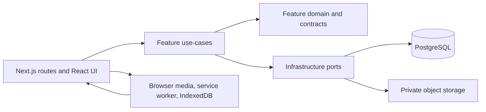
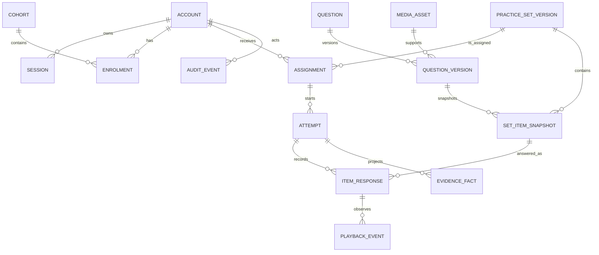
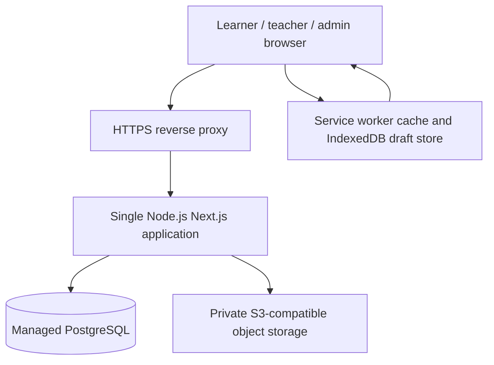

# Architecture Spine - CambridgeYLE P0

> This document owns technical invariants, not product decisions. The PRD Decision Register owns every open gate. Architecture is not implementation-ready while `GATE-HISTORICAL-ACCESS` or another implementation-blocking gate remains open.

## Design Paradigm

**Modular monolith with ports and adapters.** A single Next.js deployment owns all P0 business capabilities. A feature owns its use-cases and persistence access; its UI routes and API transport call those use-cases. Cross-feature reads use feature query services, not direct table access. External systems are reached through ports owned by `infrastructure`.

The practice domain supports exactly the five P0 engines `picture_true_false`, `picture_yes_no`, `audio_picture_choice`, `audio_note_taking`, and `word_bank_cloze`. It exposes them only through assigned, published practice-set snapshots.



## Invariants & Rules

### AD-1 - Feature ownership and dependency direction

- **Binds:** all P0 capabilities
- **Prevents:** route handlers containing business rules, or features directly importing another feature's repositories and tables
- **Rule:** Organize code under `src/features/<feature>/{domain,application,infrastructure,ui}`. UI and route handlers call application use-cases only. A feature may import `src/shared` contracts and infrastructure ports; cross-feature data is exposed as a typed query/use-case contract owned by the source feature.

### AD-2 - Server-authoritative practice lifecycle

- **Binds:** learner-practice, deterministic-scoring, teacher-evidence, media-and-pwa
- **Prevents:** client-side answer checking, client-calculated results, or results visible before a final submission
- **Rule:** The browser may render questions, preload/play approved media, collect answers/playback events, and persist a recoverable draft. The server validates authorisation and request shape, creates/updates attempts, finalises submission, scores, projects evidence, and releases answer-review data only after `submitted_at` is set.

### AD-3 - Immutable publication and attempt snapshots

- **Binds:** learner-practice, deterministic-scoring, teacher-evidence, content-publication
- **Prevents:** edited or retired questions changing a completed result, answer key, feedback, tags, or media reference
- **Rule:** Publication atomically rejects any non-approved question or media version, then materializes versioned item snapshots with rendered prompt/options, answer policy, feedback, curriculum tags, audience-scoped accessibility metadata, and immutable media object version/content hash. An attempt references exactly one published set version and its item snapshots. Editable question records never supply content or scoring data to an active or completed attempt. Snapshot media objects are write-once and retained while any publication or attempt references them.

### AD-4 - Revisioned drafts and atomic, idempotent finalisation

- **Binds:** learner-practice, deterministic-scoring, teacher-evidence
- **Prevents:** duplicate submissions, partial result persistence, evidence that disagrees with item scores, or replayed submit requests changing an attempt
- **Rule:** Every response/playback write requires the authenticated account ID, assignment ID, attempt ID and expected monotonic `revision`, locks the attempt, and requires `status = open`. A stale revision or another tab/device winning the write returns `ATTEMPT_REVISION_CONFLICT`; account/assignment key mismatch returns `ATTEMPT_SCOPE_MISMATCH`; a different idempotency key after finalisation or any post-submit write returns `ATTEMPT_FINALISED`. None overwrites server state. `submitAttempt(attemptId, expectedRevision, idempotencyKey)` runs once in a PostgreSQL transaction, reconciles the final client draft against the current revision, locks and closes the write set, validates its published snapshot, persists final responses/events, scores, projects evidence and marks the attempt submitted. A retry with the same key returns the saved result. The server response always returns the authoritative revision/state so the client can reload rather than merge answers silently.

### AD-5 - Deterministic scoring and uncertainty ownership

- **Binds:** deterministic-scoring, teacher-evidence, content-publication
- **Prevents:** an LLM or UI heuristic deciding correctness, silent acceptance of ambiguous short answers, and scoring differences between task engines
- **Rule:** The server scoring module consumes only the snapshot's versioned machine-readable `AnswerPolicy`, including exact Unicode normalisation, case/locale, whitespace/punctuation, number, accepted-answer matching semantics, and shared conformance vectors. It returns only `correct`, `incorrect`, `unanswered`, or `needs_teacher_review`. `effectiveOutcome` equals the automatic outcome unless an immutable teacher resolution exists. Teacher resolution requires the current resolution revision; a concurrent stale mutation returns `TEACHER_RESOLUTION_CONFLICT`. A correction creates a new immutable resolution version rather than overwriting history, then transactionally updates affected item evidence and aggregates from `effectiveOutcome`.

### AD-6 - Authorisation at the application boundary

- **Binds:** account-and-cohort-management, learner-practice, teacher-evidence, content-publication
- **Prevents:** role checks that exist only in navigation/UI, ID-based data exposure, or teachers accessing another cohort's learner evidence
- **Rule:** Every application use-case receives an authenticated actor and authorises both role and resource scope before reading or mutating data. Roles are `learner`, `teacher`, and `admin`; admin has P0 management authority, teacher is limited to assigned cohorts and published-set assignment, and learner is limited to own assigned attempts/results. Each assignment/attempt stores its cohort-scope snapshot. Until `GATE-HISTORICAL-ACCESS` closes, teacher access to evidence from a cohort no longer currently assigned to that teacher is default-deny; implementation must not infer a retention-access rule.

### AD-7 - Media security and PWA caching boundary

- **Binds:** media-and-pwa, learner-practice, content-publication
- **Prevents:** public enumeration of learner media, starting incomplete listening tasks, stale answer-bearing data in browser caches, or object storage being treated as a source of truth
- **Rule:** PostgreSQL owns media metadata, approval/version state, and associations; private S3-compatible storage holds binary objects. The server issues short-lived authorised media URLs only for a published snapshot. Before an attempt starts, the client verifies all essential snapshot assets are available. Every cache/IndexedDB key is namespaced by authenticated account ID plus assignment/attempt and set-version IDs; account switch, sign-out or deactivation clears the previous account's authorised assets and drafts before rendering the next account. A key/account mismatch is rejected, never adopted. Teacher/admin accessibility metadata is role-scoped; publication rejects learner-facing text/transcripts that reveal an answer. A required equivalent task is a separately approved variant linked to the same primary learning objective, selected before attempt creation, snapshot with learner-safe metadata, and marked with an evidence-comparability flag; a revealing transcript/alt text is never used as the variant. The service worker caches the application shell and authorised set assets only; IndexedDB stores local open-attempt drafts only; neither stores answer-review or teacher-evidence payloads.

### AD-8 - Account deactivation, audit, and PII minimization

- **Binds:** account-and-cohort-management, supervised-diagnostic, teacher-evidence
- **Prevents:** deactivated users retaining a session, accidental irreversible data loss, or audit trails that retain learner answers unnecessarily
- **Rule:** Account deactivation is an admin-only server transaction that sets `deactivated_at`/`deactivated_by`, revokes active sessions, prevents all future authentication/authorisation, and emits an audit event containing actor, action, target opaque ID, and timestamp only. P0 retains practice and diagnostic records after deactivation and does not implement automatic purge; store the minimum account profile necessary for centre operation and do not introduce speaking recordings.

### AD-9 - Schema migrations and typed boundary validation

- **Binds:** all P0 capabilities
- **Prevents:** manual production schema edits, schema/code drift, or trusting browser/admin payloads as valid curriculum/content data
- **Rule:** PostgreSQL changes ship as reviewed, ordered Drizzle migrations and execute before application rollout. All external input is parsed with shared Zod schemas at the route/action boundary; domain/use-case input types are inferred from or mapped from those validated contracts. Before review/publication, server validation emits publish-blocking results for required tags, allowed vocabulary/grammar, approved names/numbers, task-template sentence/option limits, answer keys/alternatives, and required approved media. An academic exception is explicit, justified, and audit logged.

### AD-10 - Evidence projection and diagnostic scope

- **Binds:** teacher-evidence, supervised-diagnostic, deterministic-scoring
- **Prevents:** dashboards with incompatible aggregation dimensions, uncertain outcomes counted as right/wrong, and a P0 diagnostic product flow beyond approved practice infrastructure
- **Rule:** Evidence facts derive only from immutable item snapshots and expose learner, cohort-scope, paper, part, vocabulary, grammar, spelling, names, numbers, colours, positions, topic, practice set, submitted time, automatic outcome, and effective outcome. Product evidence states are only `secure`, `building`, `needs practice`, and `not assessed yet`. Automatic correctness aggregates exclude unresolved `needs_teacher_review`. P0 diagnostics are admin-supervised assignments of published practice sets to pre-provisioned accounts; no separate diagnostic template, public acquisition, or self-registration flow is introduced.

### AD-11 - Content provenance is publish-blocking

- **Binds:** content-publication, media-and-pwa, learner-practice
- **Prevents:** publishing source material with unknown rights, unpublished AI output, or later losing the evidence needed to audit an approved snapshot
- **Rule:** Every question version and every referenced image, audio, script, and learner feedback record has immutable provenance metadata: `origin` (`original`, `licensed`, or `generated`), creator/source reference, rights or license reference where applicable, and generation metadata where applicable. Publication rejects incomplete provenance and snapshots this metadata with the published set. AI-originated records remain drafts until human content and academic review approve them.

### AD-12 - Separate content state machines and grandfathering

- **Binds:** content-publication, learner-practice, media-and-pwa
- **Prevents:** one asset state implicitly publishing another, rejection destroying review history, source revision mutating a publication, or retirement breaking an assigned attempt
- **Rule:** Question versions, media versions and practice-set versions each enforce their own `draft -> in_review -> approved -> published -> retired` transitions. `in_review -> rejected` records actor/reason/time and creates a new editable draft version; revision never mutates a published version. Set publication atomically verifies every referenced question/media version is published and snapshots it. Retirement prevents new publication/assignment but grandfathers existing assignments and open/submitted attempts against immutable snapshot/media versions.

### AD-13 - Assignment identity and unresolved policy boundary

- **Binds:** account-and-cohort-management, learner-practice, teacher-evidence, supervised-diagnostic
- **Prevents:** a cohort action silently changing existing learner assignments, inconsistent due-date metrics, duplicate identity collisions, or implementation inventing transfer/withdrawal semantics
- **Rule:** Every learner-visible assignment has an immutable opaque assignment ID, learner ID, published set-version ID and creation actor/time; attempt identity and authorisation bind to that record. `GATE-ASSIGNMENT-POLICY` must close before implementation chooses cohort materialisation, late join/removal, duplicate assignment, availability/due timestamps, centre timezone, status or withdrawal behaviour. Until then no derived artefact may infer those semantics.

## Consistency Conventions

| Concern | Convention |
| --- | --- |
| Naming | TypeScript uses `camelCase`; database uses `snake_case`; feature names use singular kebab-case directories; opaque UUIDv7 IDs are exposed outside the database. |
| Time and state | Persist `timestamptz` in UTC. Lifecycle states are explicit database enums/check constraints, never inferred from nullable fields. |
| API and errors | Route handlers return `{ data }` on success or `{ error: { code, message } }` on expected failure. Use stable machine codes; do not reveal login/account existence details. |
| Mutations | All mutation handlers authenticate, authorise, parse Zod input, invoke one application use-case, and write an audit event when content status, assignment, account/cohort, or teacher-review state changes. |
| Transactions | A use-case owns its transaction boundary. Repositories do not start nested transactions. Finalisation, publication, account deactivation, and teacher review are transactional. |
| Logs and audit | Structured application logs use request ID, actor opaque ID, feature/action, outcome, and error code. Never log passwords, session IDs, learner responses, answer keys, signed URLs, or raw audio. |
| Configuration | Environment variables are parsed at startup. Secrets are server-only. Browser-visible configuration is limited to non-secret public values. |

## Stack

| Name | Version |
| --- | --- |
| Node.js LTS | 24.19.0 |
| TypeScript | 7.0.2 |
| Next.js App Router | 16.3.1 |
| React and React DOM | 19.2.8 |
| Tailwind CSS | 4.3.3 |
| PostgreSQL | 18.6 |
| Drizzle ORM | 0.45.2 |
| Drizzle Kit | 0.31.10 |
| postgres.js driver | 3.4.9 |
| Zod | 4.4.3 |
| Argon2 | 0.45.1 |
| Serwist | 9.5.12 |
| Vitest | 4.1.10 |
| Playwright | 1.62.1 |

## Structural Seed

```text
src/
  app/                         # App Router pages, layouts, route handlers
  features/
    identity/                  # accounts, sessions, actor authorisation
    cohorts/                   # cohorts, enrolments, teacher scope
    curriculum/                # vocabulary, grammar, topics, validation
    content/                   # questions, media metadata, review, publication
    practice/                  # assignments, attempts, snapshots, player queries
    scoring/                   # answer-policy normalisation and deterministic scorer
    evidence/                  # teacher projections, aggregation, review resolution
    diagnostics/               # supervised diagnostic setup and account lifecycle
  shared/                      # cross-feature contracts, primitives, error types
  infrastructure/              # Drizzle/Postgres, object storage, auth, audit adapters
  pwa/                         # service worker and IndexedDB draft adapter
db/
  schema/                      # Drizzle tables and constraints
  migrations/                  # generated/reviewed SQL migrations
public/                        # manifest, PWA icons, non-sensitive static assets
tests/
  unit/                        # scorer, policies, validators, use-cases
  integration/                 # Postgres transactions, authorisation, repositories
  e2e/                         # browser/PWA learner, teacher, admin critical flows
```





**Environments:** `local`, `staging`, and `production` use separate PostgreSQL databases, storage buckets/prefixes, application secrets, and PWA cache names. Production uses HTTPS only, migration-before-rollout, health checks and structured error monitoring. `GATE-DEPLOYMENT` must approve provider, region/data residency, budget owner, backup/restore objectives (RPO/RTO) and concrete services before production launch; this document does not infer them. The provider-neutral shape remains one application plus managed PostgreSQL and private object storage.

## Capability → Architecture Map

| Capability / Area | Lives in | Governed by |
| --- | --- | --- |
| Admin-created sign-in, sessions, roles, deactivation | `identity`, `cohorts` | AD-1, AD-6, AD-8, AD-9 |
| Cohorts, enrolment, teacher scope | `cohorts` | AD-1, AD-6, AD-9 |
| Starters tags, allowed vocabulary/grammar validation | `curriculum`, `content` | AD-1, AD-3, AD-9 |
| Draft/review/approve/publish/retire content | `content` | AD-1, AD-3, AD-7, AD-9, AD-11 |
| Original media upload, approval, preloading | `content`, `infrastructure`, `pwa` | AD-2, AD-3, AD-7, AD-8, AD-11 |
| Five P0 task engines and learner drafts | `practice`, `pwa` | AD-1, AD-2, AD-7 |
| Submit-then-review feedback | `practice`, `scoring` | AD-2, AD-3, AD-4, AD-5 |
| Deterministic closed/controlled response scoring | `scoring` | AD-3, AD-4, AD-5, AD-9 |
| Item-level teacher dashboard and review | `evidence`, `practice` | AD-2, AD-3, AD-4, AD-5, AD-6, AD-10 |
| Assign published practice-set versions | `practice`, `cohorts` | AD-3, AD-6, AD-9, AD-12, AD-13 |
| Supervised diagnostic and manual account deactivation | `diagnostics`, `identity`, `practice` | AD-6, AD-8, AD-9, AD-10 |
| PWA shell, offline indication, local response recovery | `pwa`, `practice` | AD-2, AD-7 |

## Deferred

- **Production deployment:** governed only by `GATE-DEPLOYMENT`; no provider, region, data-residency, budget, RPO or RTO assumption is approved here.
- **Email delivery and password-reset mechanism:** admin-created-account flow is P0; choose provider and recovery UX before enabling self-service password recovery.
- **Retention and irreversible data purge:** P0 deactivates accounts and retains their practice/diagnostic records; `GATE-DATA-GOVERNANCE` must close before pilot launch and a later purge feature needs a separate approved decision.
- **Automatic background submission:** P0 retains drafts locally but requires connectivity to finalise, avoiding ambiguous duplicate submission; revisit after real offline pilot evidence.
- **Separate diagnostic templates:** P1 only, after pilot evidence; P0 reuses approved practice-set infrastructure under admin supervision.
- **Speaking observations and recordings:** excluded from P0 pending parent consent, retention, access, and deletion policy.
- **AI generation provider and queueing:** AI may create structured content drafts later; it cannot cross publication/scoring boundaries and needs a separate provider, privacy, and review decision.
- **Movers/Flyers, full mock templates, richer scene engines:** add as later capabilities without weakening snapshot, scorer, curriculum, or media invariants.
- **Analytics warehouse, notifications, public acquisition, payments, native apps, microservices:** out of P0; introduce only when a measured need exceeds the modular monolith.
